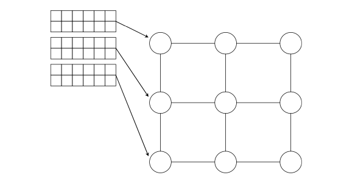
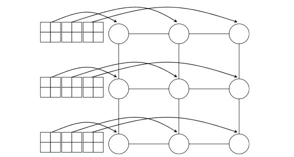
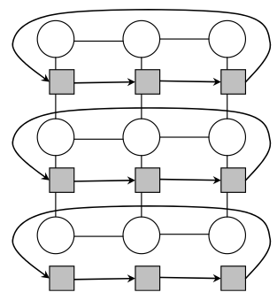
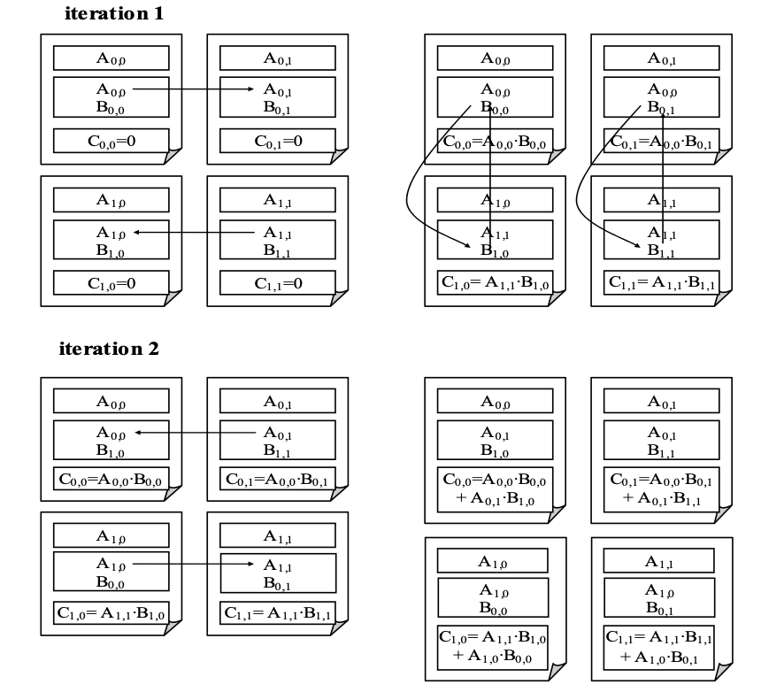
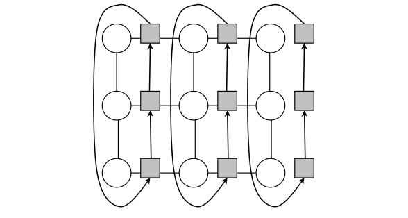

# All-Pair-Shortest-Pair
Solution to the All Pair Shortest Pair problem using C, and MPI, and implementing Fox's algorithm for matrix multiplication

# The algorithm implementation
The main idea of the program is to speed up the min-plus matrix multiplication algorithm by
partitioning the matrices in a chessboard block scheme and perform the multiplications (or the
special matrix multiplications of the min-plus algorithm) using Fox’s algorithm taking advantage of
parallelism using the MPI library. As input, we have a matrix that is loaded into three matrices:
Matrix A, matrix B, and matrix C. The A and B matrices are to be multiplied and the result is
stored in the C matrix.
In summary, the program does the following:
1. Validates the number of processes to be a perfect square (so we can later divide the matrix).
2. Read the first line of the input file (the size of the input matrix) and validate that the size
of the matrix can be divided by the size of the grid of processes. Then allocate the necessary
memory of each process. Each process has four blocks of memory for the matrix: The initial
block o f matrix A, the current block of the matrix A, the current block of the matrix B, and
the corresponding block of the result matrix C
3. Read the rest of the input file (the input matrix) and initialize the A, B, and C matrices of the
process 0. Because of the characteristic of the min-plus algorithm we have to initialize each i,j
elements when i 6 = j, and they are in 0, to the value MAX_MATRIX_VALUE, that is simply
the maximal value of integers in the programming language.
4. Create a grid of communicators. First, we create one 2d cartesian communicator of all processes
with periodicity in all ways, and from it, we then create two communicators, one for the rows
and one for columns of each process.
5. At this point, we create a barrier to make sure that all the processes have all initialized and
have all the communicators created to start the distribution of the data and the processing.
6. Distribute the matrices A, B, and C to the corresponding blocks of each process, we do this
by using the scatter function of the MPI library. First, we scatter on each element of the first
column the matrix, and then, each element of the first column will scatter to the rest of its
own row the matrix, like this:

  
   
 

7. Then we do Fox’s algorithm for parallel matrix multiplication. Where:
- For each row i, 0 ≤ i ≤ q, the block Aij of subtask(i, j) is transmitted to all the subtasks
of the same grid row; index j, which defines the position of the subtask in the row, is
computed according to the following expression: j = (i + l)mod q. We do this by using a
broadcast on the row communicator we created in step 4.

  
 

 
- Blocks A’ij, B’ij obtained by each subtask(i, j) as a result of block transmission are mul-
tiplied using the ”special matrix multiplication”, that it’s like a normal multiplication of
matrices but instead of using multiplication and sum operations, we use sum and mini-
mum, respectively. So Cij = min(Cij, A 0 ij + B 0 ij).

  
 

 
- Blocks B’ij of each subtask(i, j) is transmitted to the subtasks, which are upper neighbors
in the grid columns (the first row blocks are transmitted to the last row of the grid).
We achieve this by using the MPI’s function M P I Sendrecv replace, using the column
communicator we created in step 4. We iterate these steps until the number of iterations will be less than equal to the grid size.

  
 

8. Collect the result using the inverse process of the distribution of the matrices (step 6), using
the gather function of MPI we collect the results of each block of the matrix C on each row of
processes to the process of the first column of the row using the row communicator, and then
we use gather again to collect the results from the first column of processes to the process 0

9. We copy the result matrix C to matrix A and B, to be able to do another iteration of the
process if it is necessary

10. By iteratively repeating steps 6 to 9, will allow us to obtain the matrix Df from matrix D1 by
building successively matrices D2 = D1xD1, D4 = D2xD2, D8 = D4xD4, ... So we will repeat
these steps until Df = DgxDg, with f ≥ N and g < N. Being N the size of the rows of the
matrix.

11. Finally, we iterate towards the resulting matrix C checking for any position Ci,j in where the
value is equal to MAX_MATRIX_VALUE, in which case we change the value for 0

12. Present the resulting matrix C.

13. Clean resources used by each process and exit.

It's worth noticing that all the process can be even more optimized with MPI to achieve better performance.

## How to run
- Compile the project using the Makefile provided by using the command ”make” on the terminal
- Using the terminal run > mpirun -np {numProcesses} program {inputFile}, example: > mpirun -np 8 program input600
- If you want to know the execution time of the program you have to edit the line 10 of the fox.c
and change the value to 1: from #define DEBUG 0 to #define DEBUG 1

## License

Distributed under the MIT License. See `LICENSE` for more information.
